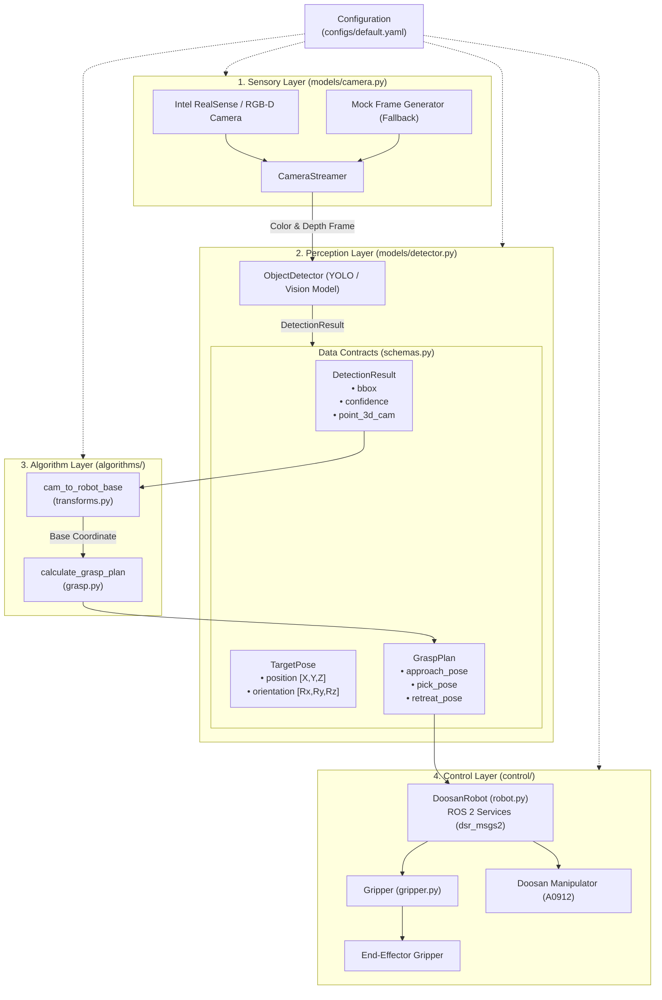

# 🦾 Doosan Robotics ROS 2 Python Research Template

[](https://www.python.org/)
[](https://docs.ros.org/en/jazzy/)
[](https://github.com/astral-sh/uv)
[](LICENSE)

두산 로보틱스(Doosan Robotics) 협동로봇(A0912 등) 기반의 **로봇 비전-제어(Vision-Guided Manipulation) 연구를 위한 표준 파이썬 템플릿 리포지토리**입니다.

새로운 연구 프로젝트(Pick-and-Place, 6D Pose Estimation, VLA/정책 학습, 강화학습 등)를 시작할 때 이 저장소를 **"Use this template"**하여 즉시 실험 및 개발 환경을 구축할 수 있습니다.

---

## 🌟 주요 특징 (Key Features)

* **계층형 아키텍처 (Layered Modular Architecture)**: 센서, 인지(AI), 기하/파지 알고리즘, 제어 모듈이 완전히 분리되어 개별 교체 및 확장이 용이합니다.
* **타입 안전한 데이터 계약 (`schemas.py`)**: `dataclass` 기반으로 검출 결과(`DetectionResult`), 로봇 포즈(`TargetPose`), 파지 계획(`GraspPlan`)을 표준화했습니다.
* **중앙 집중식 설정 관리 (`configs/default.yaml`)**: 하드웨어 IP, 카메라 파라미터, 모델 가중치, 캘리브레이션 행렬을 코드 수정 없이 YAML로 관리합니다. ([설정 가이드](docs/CONFIG_GUIDE.md))
* **현대적인 파이썬 환경 (`uv`)**: `uv`를 통해 수 초 이내에 가상환경과 의존성을 동기화하며, CLI 진입점(`doosan-main`, `doosan-jog` 등)을 기본 제공합니다.
* **통합 실행 및 환경 스크립트 (`env.sh`)**: 가상 시뮬레이터(`-virtual`)와 실기기(`-real`) 모드를 한 줄로 전환하고 즉시 실행할 수 있습니다.
* **안전 유틸리티 내장**: 안전 관절 미세조정(`doosan-jog`) 및 서보 자동 복구/Standby 전환 로직이 포함되어 있습니다.

---

## 📐 시스템 아키텍처 (System Architecture)



---

## 📋 시스템 요구사항 (Prerequisites)

* **운영체제**: Ubuntu 24.04 LTS (또는 Ubuntu 22.04)
* **ROS 2**: ROS 2 Jazzy Jalisco (또는 Humble)
* **Doosan ROS 2 패키지**: `dsr_msgs2`, `dsr_controller2`, `dsr_bringup2`
* **Python**: Python 3.12 이상
* **패키지 매니저**: [uv](https://github.com/astral-sh/uv) (`curl -LsSf https://astral.sh/uv/install.sh | sh`)

---

## 🚀 빠른 시작 가이드 (Quick Start)

### 1. 저장소 클론 및 패키지 설치
```bash
git clone https://github.com/your-org/doosan_python.git
cd doosan_python

# uv를 사용하여 모든 패키지 및 개발 의존성 동기화
uv sync --all-extras
```

### 2. ROS 2 환경 활성화
`env.sh`를 소싱하여 ROS 2 워크스페이스와 가상환경을 동시에 로드합니다.
```bash
# 가상 시뮬레이터 환경으로 로봇 런치 및 환경 로드
source env.sh -virtual

# (또는 실물 로봇 연결 시)
# source env.sh -real
```

### 3. 파이프라인 실행
```bash
# 1) 기본 메인 파이프라인 실행
uv run doosan-main

# 2) 커스텀 설정 파일 지정 실행
uv run doosan-main --config configs/default.yaml

# 3) 파일로 실행 로그 저장
uv run doosan-main --log-file runs/experiment_01.log
```

---

## 🛠️ 제공 도구 및 CLI 명령어

연구 및 하드웨어 점검을 위해 유용한 CLI 유틸리티가 패키지에 등록되어 있습니다:

| 명령어 | 설명 | 소스 파일 |
| :--- | :--- | :--- |
| `doosan-main` | 비전 기반 파지 파이프라인 메인 실행 | [`src/doosan_python/main.py`](file:///home/ahrism/workspace/doosan_python/src/doosan_python/main.py) |
| `doosan-jog` | 터미널 대화형 1~6축 관절 미세 조정 콘솔 | [`src/doosan_python/interactive_jog.py`](file:///home/ahrism/workspace/doosan_python/src/doosan_python/interactive_jog.py) |
| `doosan-adjust` | 6번 관절(손목) ±5도 왕복 안전 동작 테스트 | [`src/doosan_python/adjust_joint.py`](file:///home/ahrism/workspace/doosan_python/src/doosan_python/adjust_joint.py) |

---

## 📁 디렉토리 구조 (Directory Structure)

```text
doosan_python/
├── configs/                  # 실험 환경별 설정 파일 디렉토리
│   └── default.yaml          # 기본 설정 (로봇 IP, 카메라, 모델, 캘리브레이션)
├── docs/                     # 기술 문서 및 가이드
│   ├── CONFIG_GUIDE.md       # 설정 항목 상세 매핑 가이드
│   └── ROBOT_TOPICS_GUIDE.md # 초심자를 위한 ROS 2 주요 토픽 쉬운 설명서
├── src/
│   └── doosan_python/        # 메인 파이썬 패키지 소스
│       ├── algorithms/       # 순수 기하학/수학 알고리즘 (하드웨어 무관)
│       │   ├── grasp.py      # 파지(Grasp) 궤적 및 포즈 계획
│       │   └── transforms.py # 카메라-로봇 좌표계 변환 행렬
│       ├── control/          # 로봇 및 엔드이펙터 제어 계층
│       │   ├── gripper.py    # 그리퍼 인터페이스
│       │   └── robot.py      # 두산 로봇 ROS 2 서비스 제어기 (DoosanRobot)
│       ├── models/           # 비전 센서 및 딥러닝 모델 계층
│       │   ├── camera.py     # RealSense 카메라 스트리머 (스레드 버퍼링)
│       │   └── detector.py   # 객체 검출 및 포즈 추정 추론기
│       ├── utils/            # 유틸리티
│       │   └── logger.py     # 표준 컬러 로거 설정 모듈
│       ├── adjust_joint.py   # 관절 왕복 안전 테스트 스크립트
│       ├── config.py         # 타입 안전한 YAML 설정 로더
│       ├── interactive_jog.py# 대화형 관절 조그 제어 스크립트
│       ├── main.py           # 파이프라인 진입점 엔트리포인트
│       └── schemas.py        # 표준 데이터 계약 (dataclass)
├── env.sh                    # 환경 로드 및 원클릭 로봇 런치 쉘 스크립트
├── pyproject.toml            # 패키지 메타데이터 및 의존성 정의
└── uv.lock                   # 재현 가능한 의존성 잠금 파일
```

---

## 🔬 연구 확장 가이드 (Research Extension Guide)

새로운 연구를 시작할 때 본 템플릿을 확장하는 권장 절차입니다:

### 1. 커스텀 인공지능 모델 연결
[`src/doosan_python/models/detector.py`](file:///home/ahrism/workspace/doosan_python/src/doosan_python/models/detector.py)의 `infer()` 메서드 내부에 본인의 YOLO, Mask R-CNN, Depth-based Pose Estimator 등을 연결하고 반환형태를 `DetectionResult` 리스트로 규격화하세요.

### 2. 커스텀 파지(Grasp) 알고리즘 적용
[`src/doosan_python/algorithms/grasp.py`](file:///home/ahrism/workspace/doosan_python/src/doosan_python/algorithms/grasp.py)의 `calculate_grasp_plan()` 함수에서 AnyGrasp, Contact-GraspNet 등의 신경망 기반 6-DoF 파지 포즈 생성 로직을 추가하고 `GraspPlan` 객체로 반환하도록 확장할 수 있습니다.

### 3. 커스텀 그리퍼 하드웨어 연동
[`src/doosan_python/control/gripper.py`](file:///home/ahrism/workspace/doosan_python/src/doosan_python/control/gripper.py)의 `open()`과 `close()`에 시리얼(Modbus RTU), 디지털 I/O, 혹은 진공 흡착 제어 신호를 작성하여 하드웨어를 제어하세요.

---

## 📄 라이선스 (License)

이 템플릿은 [MIT License](LICENSE) 하에 자유롭게 연구 및 상업적 목적으로 활용할 수 있습니다.
